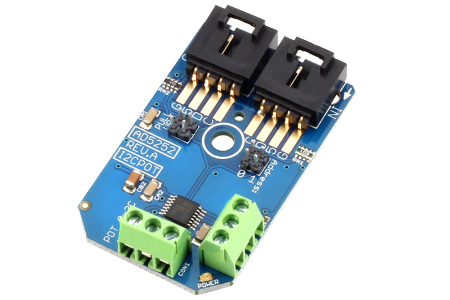

[](https://www.controleverything.com/content/Potentiometers?sku=AD5252_I2CPOT_10K)
# AD5252
AD5252 Digital Potentiometer.

The AD5252 is a 2-Channel digital Potentiometer.

This Device is available from ControlEverything.com [SKU: AD5252_I2CPOT_10K]

https://www.controleverything.com/content/Potentiometers?sku=AD5252_I2CPOT_10K

This Sample code can be used with Raspberry Pi, Arduino, Particle Photon, Beaglebone Black and Onion Omega.

## Java
Download and install pi4j library on Raspberry pi. Steps to install pi4j are provided at:

http://pi4j.com/install.html

Download (or git pull) the code in pi.

Compile the java program.
```cpp
$> pi4j AD5252.java
```

Run the java program.
```cpp
$> pi4j AD5252
```

## Python
Download and install smbus library on Raspberry pi. Steps to install smbus are provided at:

https://pypi.python.org/pypi/smbus-cffi/0.5.1

Download (or git pull) the code in pi. Run the program.

```cpp
$> python AD5252.py
```

## Arduino
Download and install Arduino Software (IDE) on your machine. Steps to install Arduino are provided at:

https://www.arduino.cc/en/Main/Software

Download (or git pull) the code and double click the file to run the program.

Compile and upload the code on Arduino IDE and see the output on Serial Monitor.


## Particle Photon

Login to your Photon and setup your device according to steps provided at:

https://docs.particle.io/guide/getting-started/connect/photon/

Download (or git pull) the code. Go to online IDE and copy the code.

https://build.particle.io/build/

Verify and flash the code on your Photon. Code output is shown in logs at dashboard:

https://dashboard.particle.io/user/logs


##C

Download (or git pull) the code in Beaglebone Black.

Compile the c program.
```cpp
$>gcc AD5252.c -o AD5252
```
Run the c program.
```cpp
$>./AD5252
```

## Onion Omega

Get Started and setting up the Onion Omega according to steps provided at :

https://wiki.onion.io/Get-Started

To install the Python module, run the following commands:
```cpp
opkg update
```
```cpp
opkg install python-light pyOnionI2C
```

Download (or git pull) the code in Onion Omega. Run the program.

```cpp
$> python AD5252.py
```

#####The code sets the digital value of resistance.
